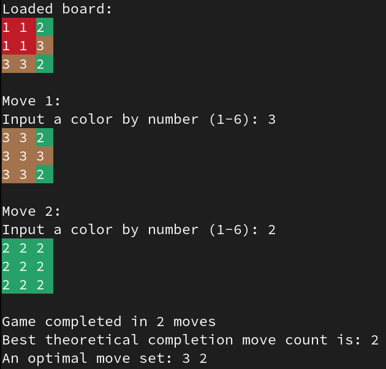

# flood-it

A flood fill based terminal game.

The objective of the game is to fill the board with the same colour in the least number of moves as possible by choosing successive colours to flood fill from the top-left cell.

This project also incorporates a graph traversal algorthm that finds the least number of moves to complete a starting configuration (more infomation below).

Example game play:

## Dependencies
* `g++`

## Compiling and linking
* `git clone https://github.com/rickybassom/flood-it.git`
* `cd flood-it`
* `./compile_and_link.sh`

## Running
* `./Boardgame` to start a game with a randomly generated board of inputted size.
* Or `./Boardgame filename.txt` to open a board file. See `example_boards/` for examples.

## Description of heuristic search solution solver

* [Iterative Deepening A*](https://en.wikipedia.org/wiki/Iterative_deepening_A*) is used to find the theoretical minimum number of steps for completing the game. The algorithm can be found in methods `Game::search` and `Game::ida_star`.

* Each move that can be played at a current game state is represented as a `MoveNode`. A `MoveNode` stores the colour move made last, a snapshot of the board at that point and the number of moves it took to get there. The `MoveNode` can create children `MoveNode`s to represent later moves. This creates a dynamically generated graph that can be used for iterative deepening a* traversal.

* The heuristic I have chosen for a* search is the "number of colours left on the board" because this is the theoretical minimum number of moves the user would have to play on the board to make the board a single colour. 

* Optimisations made to this include caching `MoveNode` children so that those `MoveNode`s don’t need to be generated every time the algorithm wants to visit them. Another optimization I made was to cache board node combinations along with the least number of moves it took to get there. This was so that I could stop traversing a `MoveNode` when I know that somewhere else I have gotten to has got there in less moves.

